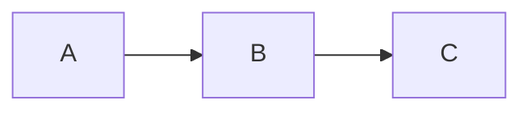

# Mermaid Support (added files)

已添加用于支持 Mermaid 的文件到分支 `feature/add-mermaid-support`：

- `layouts/_default/_markup/render-codeblock.html` — render hook，把 ```mermaid 的 fenced code block 渲染为 `<div class="mermaid">`。
- `layouts/partials/mermaid.html` — partial，引入 mermaid.js 并初始化（请将此 partial 在你的 base 模板中 `</body>` 前包含）。
- `layouts/shortcodes/mermaid.html` — 可选 shortcode，用法示例见下。

使用方法：

1. 自动方式（推荐）

在 Markdown 中直接使用 fenced code block：

````markdown

````

2. Shortcode（如果你更喜欢短标签）：

```
{}
graph LR
  A --> B
{}
```

手动在 base 模板中加入 partial：

在你的 `layouts/_default/baseof.html`（或站点使用的 base 模板）中，找到 `</body>` 并在其之前加入：

```html
{{ partial "mermaid.html" . }}
```

注意事项：
- 此实现依赖客户端渲染，使用 CDN 的 mermaid.js。如需离线或构建时渲染，可改为在 CI 中使用 mermaid-cli 预渲染。
- 如果你的站点对 HTML 进行了严格净化（sanitize），请确保允许 mermaid 的源码被渲染（render hook 使用 `safeHTML`）。

---

请在确认后在 GitHub 上打开 PR：
https://github.com/Enigma-Soul/Blog/compare/master...feature/add-mermaid-support

如果需要我帮你也更新 baseof.html（若能提供文件路径或允许我查找并修改），我可以在后续提交中直接修改它.
